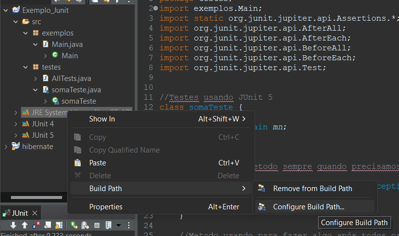
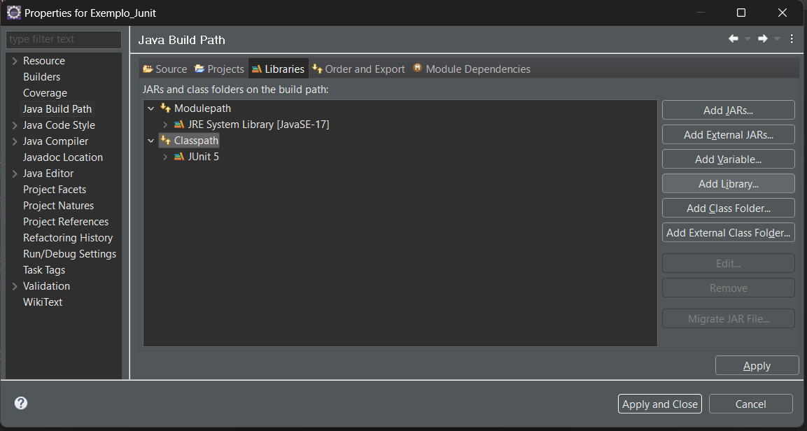
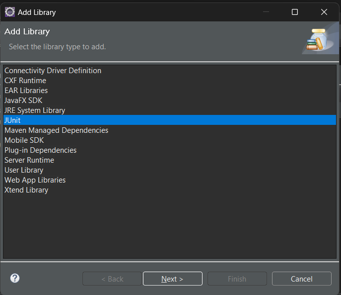
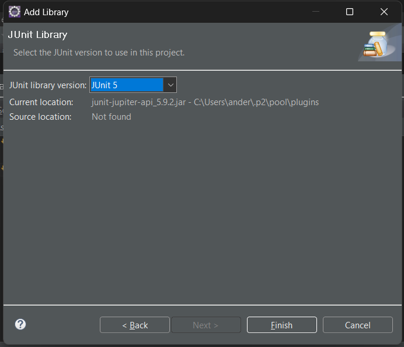
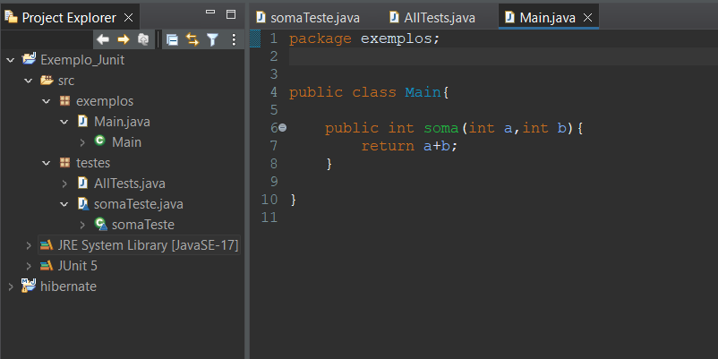
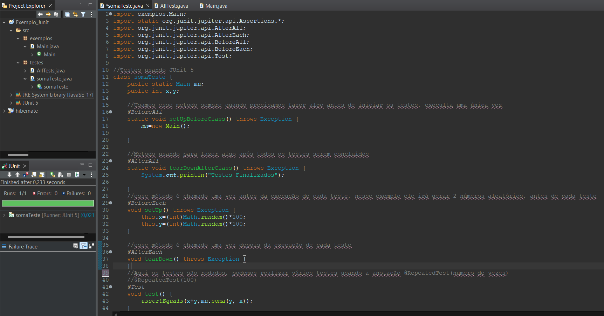
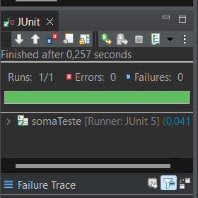

# Teste Unitario com JUnit5

Os testes são realizados com a intenção de descobrir erros e defeitos em um sistema, os testes podem ser usados para indicar a presença de defeito mas nunca a ausência deles, nenhum teste é 100% preciso.
Existes vários testes, entre eles o teste unitário que tem por objetivo testar a menor unidade testável do projeto, pode ser uma método ou uma classe, por exemplo, o uso dos teste unitários evita ter que criar o método main, para cada parte do projeto que deseja testar.

O JUnit é uma framework open-source desenvolvido em java, utilizado para criação teste de unitários e testes automatizados.

O JUnit divide-se em:
        -TestSuite: usado para a execução de vários TesteCase simultâneos;
        -TestCase: usados para realizar um teste unitário;
        -TesteResult: usado para coletar o resultado de execulção de testeCase;
        -Runner: é o responsável por instanciar uma classe de testes e executar todos os seus respectivos métodos.

Usamos o Assert para realizar a afirmação do método, com ela conseguimos definir o que queremos testar, por exemplo, com o assetEquals o teste ira testar a unidade e irá verificar se o valor retornado é igual ao valor esperado.
Assert:
    -assertEquals(valor esperado,valor recebido);
    -assertNotEquals(valor esperado,valor recebido);
    -assertTrue(condição booleana);
    -assertNotTrue(condição booleana);
    -assertNull(Objeto);
    -assertNotNull(Objeto);
    -assertThrows

Para cada classe que queremos testar, devemos cliar uma classe teste, se temos uma Classe soma que realiza a operação de soma, devemos criar uma classe somaTeste.
Usamos anotações para fazer as indicações na classe teste
     anotações:
         -@BeforeEach  -  roda uma vez antes de cada teste;
         -@AfterEach   -  roda uma vez depois de cada teste;
         -@BeforeAll   - roda uma única vez no início do teste;
         -@AfterAll    - roda uma única vez no termino de todos os testes;
         -@test        - indica qual é a classe teste.

Podemos também realizar testes automatizados usando a anotação @RepeatedTest(número_de_vezes).

Etapas:
1° Devemos incluir a biblioteca JUnit no Projeto, usando o eclipse você pode incluir fazendo:

        Clicar sobre o ClassPath e selecionar o botão a direita "Add Library"

2° Criar a Classe que queremos testar
     

3° Criar a Classe Teste
     

4° 

Fim